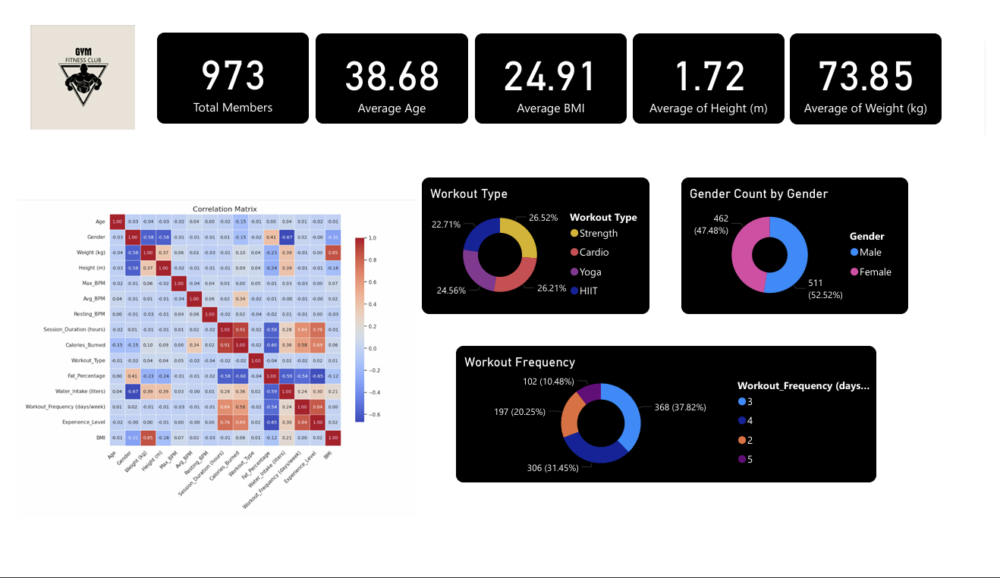
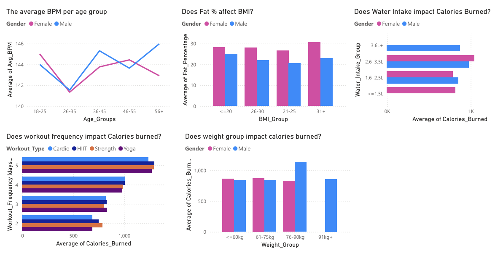

# Gym Membership Data Analysis

This project presents a data visualization dashboard created in **Power BI** to explore a dataset of gym members. The goal is to uncover meaningful patterns and correlations between physiological attributes, behavioral habits, and fitness outcomes. The analysis provides insights that can help both fitness enthusiasts and professionals make data-driven decisions for healthier routines.

---

### 👥 Group Members

* Archi Setio (2702255962)
* Albertus Christian (2702255703)
* Dominikus Sebastian Ramli (2702329664)
* Vincentius Andrew Lorenzo (2702262860)
* Vincent Tanaka (2702255956)
* Vincent Virgo (2702250381)
* Wilbert Bernardi (2702255786)

---

### 📊 Dataset and Tools

The project uses the **Gym Members Exercise Dataset** from Kaggle, which includes detailed information on:
* **Physiological Data:** Age, BMI, body fat percentage, height, and weight.
* **Behavioral Data:** Water intake, workout frequency, and session duration.
* **Performance Metrics:** Calories burned, Max BPM, Avg BPM, and Resting BPM.

The primary tool for this analysis and visualization is **Power BI**.

* [Gym Member Dataset on Kaggle](https://www.kaggle.com/datasets/valakhor/asani/gym-members-exercise-dataset)

---

### 📈 Key Findings & Visualizations

The Power BI dashboard provides a comprehensive overview through various charts and metrics:

#### **General Statistics & Distribution**
* **Total Members:** The dashboard displays the total number of members in the dataset.
* **Averages:** Key metrics such as average age, BMI, height, and weight are clearly shown.
* **Demographics:** Donut charts illustrate the distribution of members by **gender**  and **workout type** (Strength, Cardio, Yoga, HIIT) .
* **Workout Habits:** A donut chart visualizes the distribution of **workout frequency** in days per week.

#### **Correlations & Impact Analysis**
* **Correlation Matrix:** A heatmap shows the correlation between all numerical variables, helping to identify strong positive or negative relationships. * **Heart Rate by Age:** A line chart compares the average BPM per age group for both male and female members, highlighting how heart rate changes with age.
* **Impact on Calories Burned:** Bar charts and column charts analyze how calories burned are impacted by:
    * **Water Intake:** Comparing average calories burned across different water intake groups.
    * **Workout Frequency:** Showing how different workout frequencies (days/week) correlate with average calories burned.
    * **Weight Group:** Analyzing the average calories burned across different weight ranges.
* **BMI and Body Fat:** A bar chart explores the relationship between **Body Fat Percentage** and **BMI Group**, broken down by gender.

